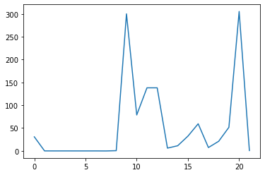
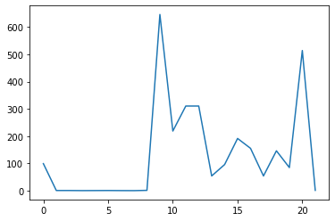
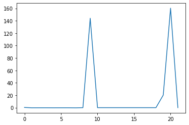
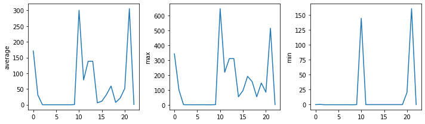
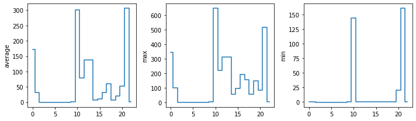

## Visualizing data
The mathematician Richard Hamming once said, "The purpose of computing is insight, not numbers," and
the best way to develop insight is often to visualize data.  Visualization deserves an entire
lecture of its own, but we can explore a few features of Python's `matplotlib` library here.  While
there is no official plotting library, `matplotlib` is the _de facto_ standard.  First, we will
import the `pyplot` module from `matplotlib` and use two of its functions to create and display a
[heat map]({{ page.root }}/reference.html#heat-map) of our data:

~~~
import matplotlib.pyplot
image = matplotlib.pyplot.imshow(data[:40,:])
matplotlib.pyplot.show()
~~~
{: .language-python}

Blue pixels in this heat map represent low values, while yellow pixels represent high values.  As we
can see, the scale of these features varies dramatically, and within a particular feature there is variation
between molecules.

~~~
ave_feature_value = numpy.mean(data, axis=0)
ave_plot = matplotlib.pyplot.plot(ave_feature_value)
matplotlib.pyplot.show()
~~~
{: .language-python}

Here, we have put the of each feature across all molecules in the variable
`ave_feature_value`, then asked `matplotlib.pyplot` to create and display a line graph of those
values.

Let's produce the same for the maximum.

~~~
max_plot = matplotlib.pyplot.plot(numpy.max(data, axis=0))
matplotlib.pyplot.show()
~~~
{: .language-python}

~~~
min_plot = matplotlib.pyplot.plot(np.min(data, axis=0))
matplotlib.pyplot.show()
~~~
{: .language-python}

### Grouping plots
You can group similar plots in a single figure using subplots.
This script below uses a number of new commands. The function `matplotlib.pyplot.figure()`
creates a space into which we will place all of our plots. The parameter `figsize`
tells Python how big to make this space. Each subplot is placed into the figure using
its `add_subplot` [method]({{ page.root }}/reference.html#method). The `add_subplot` method takes 3
parameters. The first denotes how many total rows of subplots there are, the second parameter
refers to the total number of subplot columns, and the final parameter denotes which subplot
your variable is referencing (left-to-right, top-to-bottom). Each subplot is stored in a
different variable (`axes1`, `axes2`, `axes3`). Once a subplot is created, the axes can
be titled using the `set_xlabel()` command (or `set_ylabel()`).
Here are our three plots side by side:

~~~
import numpy
import matplotlib.pyplot

data = numpy.loadtxt(fname='combined-no-headers.csv', delimiter=',')
array = np.delete(array, 0, 1)

fig = matplotlib.pyplot.figure(figsize=(10.0, 3.0))

axes1 = fig.add_subplot(1, 3, 1)
axes2 = fig.add_subplot(1, 3, 2)
axes3 = fig.add_subplot(1, 3, 3)

axes1.set_ylabel('average')
axes1.plot(numpy.mean(data, axis=0))

axes2.set_ylabel('max')
axes2.plot(numpy.max(data, axis=0))

axes3.set_ylabel('min')
axes3.plot(numpy.min(data, axis=0))

fig.tight_layout()

matplotlib.pyplot.savefig('features.png')
matplotlib.pyplot.show()
~~~
{: .language-python}

The [call]({{ page.root }}/reference.html#function-call) to `loadtxt` reads our data,
and the rest of the program tells the plotting library
how large we want the figure to be,
that we're creating three subplots,
what to draw for each one,
and that we want a tight layout.
(If we leave out that call to `fig.tight_layout()`,
the graphs will actually be squeezed together more closely.)

The call to `savefig` stores the plot as a graphics file. This can be
a convenient way to store your plots for use in other documents, web
pages etc. The graphics format is automatically determined by
Matplotlib from the file name ending we specify; here PNG from
'features.png'. Matplotlib supports many different graphics
formats, including SVG, PDF, and JPEG.

> ## Importing libraries with shortcuts
>
> In this lesson we use the `import matplotlib.pyplot`
> [syntax]({{ page.root }}/reference.html#syntax)
> to import the `pyplot` module of `matplotlib`. However, shortcuts such as
> `import matplotlib.pyplot as plt` are frequently used.
> Importing `pyplot` this way means that after the initial import, rather than writing
> `matplotlib.pyplot.plot(...)`, you can now write `plt.plot(...)`.
> Another common convention is to use the shortcut `import numpy as np` when importing the
> NumPy library. We then can write `np.loadtxt(...)` instead of `numpy.loadtxt(...)`,
> for example.
>
> Some people prefer these shortcuts as it is quicker to type and results in shorter
> lines of code - especially for libraries with long names! You will frequently see
> Python code online using a `pyplot` function with `plt`, or a NumPy function with
> `np`, and it's because they've used this shortcut. It makes no difference which
> approach you choose to take, but you must be consistent as if you use
> `import matplotlib.pyplot as plt` then `matplotlib.pyplot.plot(...)` will not work, and
> you must use `plt.plot(...)` instead. Because of this, when working with other people it
> is important you agree on how libraries are imported.
{: .callout}

> ## Plot Scaling
>
> Why do all of our plots stop just short of the upper end of our graph?
>
> > ## Solution
> > Because matplotlib normally sets x and y axes limits to the min and max of our data
> > (depending on data range)
> {: .solution}
>
> If we want to change this, we can use the `set_ylim(min, max)` method of each 'axes',
> for example:
>
> ~~~
> axes3.set_ylim(0,6)
> ~~~
> {: .language-python}
>
> Update your plotting code to automatically set a more appropriate scale.
> (Hint: you can make use of the `max` and `min` methods to help.)
>
> > ## Solution
> > ~~~
> > # One method
> > axes3.set_ylabel('min')
> > axes3.plot(numpy.min(data, axis=0))
> > axes3.set_ylim(0,6)
> > ~~~
> > {: .language-python}
> {: .solution}
>
> > ## Solution
> > ~~~
> > # A more automated approach
> > min_data = numpy.min(data, axis=0)
> > axes3.set_ylabel('min')
> > axes3.plot(min_data)
> > axes3.set_ylim(numpy.min(min_data), numpy.max(min_data) * 1.1)
> > ~~~
> > {: .language-python}
> {: .solution}
{: .challenge}

> ## Drawing Straight Lines
>
> In the center and right subplots above, we expect all lines to look like step functions because
> non-integer value are not realistic for the minimum and maximum values. However, you can see
> that the lines are not always vertical or horizontal, and in particular the step function
> in the subplot on the right looks slanted. Why is this?
>
> > ## Solution
> > Because matplotlib interpolates (draws a straight line) between the points.
> > One way to do avoid this is to use the Matplotlib `drawstyle` option:
> >
> > ~~~
> > import numpy
> > import matplotlib.pyplot
> >
> > data = numpy.loadtxt(fname='combined-no-headers.csv', delimiter=',')
> >
> > fig = matplotlib.pyplot.figure(figsize=(10.0, 3.0))
> >
> > axes1 = fig.add_subplot(1, 3, 1)
> > axes2 = fig.add_subplot(1, 3, 2)
> > axes3 = fig.add_subplot(1, 3, 3)
> >
> > axes1.set_ylabel('average')
> > axes1.plot(numpy.mean(data, axis=0), drawstyle='steps-mid')
> >
> > axes2.set_ylabel('max')
> > axes2.plot(numpy.max(data, axis=0), drawstyle='steps-mid')
> >
> > axes3.set_ylabel('min')
> > axes3.plot(numpy.min(data, axis=0), drawstyle='steps-mid')
> >
> > fig.tight_layout()
> >
> > matplotlib.pyplot.show()
> > ~~~
> > {: .language-python}
> 
> {: .solution}
{: .challenge}

> ## Make Your Own Plot
>
> Create a plot showing the standard deviation (`numpy.std`)
> of the inflammation data for each day across all patients.
>
> > ## Solution
> > ~~~
> > std_plot = matplotlib.pyplot.plot(numpy.std(data, axis=0))
> > matplotlib.pyplot.show()
> > ~~~
> > {: .language-python}
> {: .solution}
{: .challenge}

> ## Moving Plots Around
>
> Modify the program to display the three plots on top of one another
> instead of side by side.
>
> > ## Solution
> > ~~~
> > import numpy
> > import matplotlib.pyplot
> >
> > data = numpy.loadtxt(fname='combined-no-headers.csv', delimiter=',')
> > array = np.delete(array, 0, 1)
> >
> > # change figsize (swap width and height)
> > fig = matplotlib.pyplot.figure(figsize=(3.0, 10.0))
> >
> > # change add_subplot (swap first two parameters)
> > axes1 = fig.add_subplot(3, 1, 1)
> > axes2 = fig.add_subplot(3, 1, 2)
> > axes3 = fig.add_subplot(3, 1, 3)
> >
> > axes1.set_ylabel('average')
> > axes1.plot(numpy.mean(data, axis=0))
> >
> > axes2.set_ylabel('max')
> > axes2.plot(numpy.max(data, axis=0))
> >
> > axes3.set_ylabel('min')
> > axes3.plot(numpy.min(data, axis=0))
> >
> > fig.tight_layout()
> >
> > matplotlib.pyplot.show()
> > ~~~
> > {: .language-python}
> {: .solution}
{: .challenge}

## Pandas
Pandas is a powerful dataframe tool that allows you to interact with data in a manner more like
an Excel sheet or R - it's the arrays we have been using in Numpy, but with labeling retained!

~~~
import pandas as pd
df = pd.read_csv('Acyclic.csv')
print(df)
~~~
{: .language-python}
~~~
     Unnamed: 0   %top   ER1   ER2  ER3   ER4  ER5  ER6   ER7  EZ  ...  \
0             0   2.25 -0.09  0.00  0.0 -0.09  0.0  0.0  0.00   1  ...   
1             1   2.50 -0.09  0.00  0.0 -0.09  0.0  0.0  0.00   1  ...   
2             2   5.00 -0.09  0.00  0.0 -0.09  0.0  0.0  0.00   1  ...   
3             3   5.00 -0.09  0.00  0.0 -0.09  0.0  0.0  0.00   1  ...   
4             4   3.50 -0.01 -0.17  0.0 -0.01  0.0  0.0 -0.17   1  ...   
..          ...    ...   ...   ...  ...   ...  ...  ...   ...  ..  ...   
174         174   2.50  0.36  0.00  0.0 -0.17  0.0  0.0 -0.15   1  ...   
175         175   3.25  0.36  0.00  0.0 -0.17  0.0  0.0 -0.15   1  ...   
176         176   5.00  0.36  0.00  0.0 -0.17  0.0  0.0 -0.15   1  ...   
177         177   2.00  0.36  0.00  0.0 -0.17  0.0  0.0 -0.15   1  ...   
178         178  15.00  0.36  0.00  0.0 -0.17  0.0  0.0 -0.15   1  ...   

                                       boron reagent  equivs boron reagent  \
0                                   OB(C1=CC=CC=C1)O                   2.0   
1                                   OB(C1=CC=CC=C1)O                   2.0   
2                                   OB(C1=CC=CC=C1)O                   3.0   
3    C1(B2OB(C3=CC=CC=C3)OB(C4=CC=CC=C4)O2)=CC=CC=C1                   2.0   
4                                   OB(C1=CC=CC=C1)O                   2.0   
..                                               ...                   ...   
174                                 OB(C1=CC=CC=C1)O                   2.4   
175                              CC1=CC(B(O)O)=CC=C1                   2.4   
176                                 OB(C1=CC=CC=C1)O                   2.0   
177                                 OB(C1=CC=CC=C1)O                   2.4   
178                                 OB(C1=CC=CC=C1)O                   2.4   

     ligand  mol% Rh  mol% ligand      solvent  \
0      L3.1      1.5          3.0  dioxane/H2O   
1      L3.1      1.5          3.3  dioxane/H2O   
2      L3.1      2.5          5.5  dioxane/H2O   
3      L3.1      1.5          3.0  dioxane/H2O   
4     L3.10      1.5          3.6      dioxane   
..      ...      ...          ...          ...   
174   L3.86      2.5          6.0  dioxane/H2O   
175   L3.86      2.5          6.0  dioxane/H2O   
176   L3.86      2.5          6.0  dioxane/H2O   
177   L3.86      2.5          6.0  dioxane/H2O   
178   L3.87      2.5          6.0  dioxane/H2O   

                                       substrate  temp  time  yield  
0                               CC(/C=C/C(C)C)=O    30   3.0   81.0  
1                               CC(/C=C/CCCCC)=O    30   1.0   84.0  
2              O=C(/C=C/C(OC(C)(C)C)=O)OC(C)(C)C    50   3.0   78.0  
3                            O=C(/C=C/CCC)OC(C)C    50   1.0   73.0  
4                               CC(/C=C/C(C)C)=O    25   1.0   91.0  
..                                           ...   ...   ...    ...  
174                 CCCC/C=C/C1=NC2=CC=CC=C2C=C1    80   0.5   56.0  
175                 CCCC/C=C/C1=NC2=CC=CC=C2C=C1    80   0.5   71.0  
176      C12=CC=CC=C1N=CC(/C=C/CCC3=CC=CC=C3)=N2    80   0.5   80.0  
177  O=[N+](C1=CC=C(/C=C/CCC2=CC=CC=C2)C=C1)[O-]    80   0.5   35.0  
178  O=[N+](C1=CC=C(/C=C/CCC2=CC=CC=C2)C=C1)[O-]   120   0.5   76.0  

[179 rows x 40 columns]
~~~
{: .output}

This is dramatically different to the array function where we worked with a csv file where the headers had been stripped out, and where we stripped
out the first column - the index. Printing this dataframe is very informative, displaying the headers and the indices, plus the size of dataframe. The best thing is we can now do some work using those labels!

There is a lot of data so let's filter it and remove some columns.

~~~
df = df.filter(['solvent', '%top', 'temp', 'time', 'yield'])
print(df)
print(df['solvent']) # print just the solvent column
~~~
{: .language-python}
~~~
         solvent   %top  temp  time  yield
0    dioxane/H2O   2.25    30   3.0   81.0
1    dioxane/H2O   2.50    30   1.0   84.0
2    dioxane/H2O   5.00    50   3.0   78.0
3    dioxane/H2O   5.00    50   1.0   73.0
4        dioxane   3.50    25   1.0   91.0
..           ...    ...   ...   ...    ...
174  dioxane/H2O   2.50    80   0.5   56.0
175  dioxane/H2O   3.25    80   0.5   71.0
176  dioxane/H2O   5.00    80   0.5   80.0
177  dioxane/H2O   2.00    80   0.5   35.0
178  dioxane/H2O  15.00   120   0.5   76.0

[179 rows x 5 columns]
0      dioxane/H2O
1      dioxane/H2O
2      dioxane/H2O
3      dioxane/H2O
4          dioxane
          ...     
174    dioxane/H2O
175    dioxane/H2O
176    dioxane/H2O
177    dioxane/H2O
178    dioxane/H2O
Name: solvent, Length: 179, dtype: object
~~~
{: .output}

Printing a column now is much more human readable as we just need the name of the column. And when we want to do some work upon that data, we can convert first to a normal array.

~~~
df.to_numpy()
~~~
{: .language-python}
~~~
array([['dioxane/H2O', 2.25, 30, 3.0, 81.0],
       ['dioxane/H2O', 2.5, 30, 1.0, 84.0],
       ['dioxane/H2O', 5.0, 50, 3.0, 78.0],
       ['dioxane/H2O', 5.0, 50, 1.0, 73.0],
       ['dioxane', 3.5, 25, 1.0, 91.0],
       ['MeOH/CH2Cl2', 33.0, 60, 1.0, 89.0],
       ['MeOH/CH2Cl2', 11.5, 60, 1.0, 99.0],
       ['MeOH/CH2Cl2', 1.275, 60, 1.0, 92.0],
       ['i-PrOH/CH2Cl2', 1.833333333, 60, 1.0, 99.0],
       ['i-PrOH/CH2Cl2', 1.666666667, 60, 1.0, 85.0],
       ['i-PrOH/CH2Cl2', 2.166666667, 60, 1.0, 99.0],
       ['i-PrOH/CH2Cl2', 1.75, 60, 1.0, 99.0],
       ['i-PrOH/CH2Cl2', 1.25, 60, 1.0, 99.0],
       ['i-PrOH/CH2Cl2', 2.0, 60, 1.0, 99.0],
       ['i-PrOH/CH2Cl2', 1.0, 60, 1.0, 99.0],
       ['i-PrOH/CH2Cl2', 1.0, 60, 1.0, 99.0],
       ['i-PrOH/CH2Cl2', 0.5, 60, 1.0, 99.0],
       ['i-PrOH/CH2Cl2', 1.5, 60, 1.0, 77.0],
       ['i-PrOH/CH2Cl2', 1.75, 60, 1.0, 99.0],
       ['MeOH/CH2Cl2', 1.0, 60, 1.0, 83.0],
       ['i-PrOH/CH2Cl2', 2.5, 60, 1.0, 74.0],
       ['toluene/H2O', 25.0, 50, 23.0, 67.0],
       ['dioxane', 11.5, 25, 1.0, 90.0],
       ['toluene/H2O', 23.0, 50, 23.0, 85.0],
       ['dioxane', 11.0, 25, 1.0, 72.0],
       ['dioxane', 8.5, 25, 1.0, 100.0],
       ['toluene/H2O', 22.5, 50, 23.0, 56.0],
       ['EtOH', 2.0, 30, 2.0, 89.0],
       ['EtOH', 2.0, 30, 2.0, 89.0],
       ['EtOH', 3.5, 30, 8.0, 99.0],
       ['toluene/H2O', 28.0, 50, 23.0, 98.0],
       ['dioxane', 4.5, 25, 1.0, 85.0],
       ['toluene/H2O', 27.5, 50, 23.0, 90.0],
       ['dioxane', 3.625, 25, 1.0, 87.0],
       ['EtOH', 1.0, 25, 96.0, 68.0],
       ['EtOH', 3.25, 25, 11.0, 86.0],
       ['EtOH', 1.5, 25, 5.5, 72.0],
       ['EtOH', 2.0, 25, 50.0, 74.0],
       ['EtOH', 2.5, 25, 25.0, 77.0],
       ['EtOH', 5.0, 25, 24.0, 94.0],
       ['EtOH', 1.4, 25, 96.0, 80.0],
       ['EtOH', 2.75, 25, 16.0, 99.0],
       ['EtOH', 0.3, 25, 72.0, 99.0],
       ['EtOH', 11.0, 25, 27.0, 98.0],
       ['EtOH', 3.0, 25, 16.0, 95.0],
       ['EtOH', 1.0, 60, 2.0, 81.0],
       ['EtOH', 0.5, 60, 14.0, 99.5],
       ['EtOH', 2.0, 60, 23.0, 88.0],
       ['toluene/H2O', 8.125, 50, 1.5, 85.0],
       ['dioxane/H2O', 11.0, 30, 1.0, 89.0],
       ['dioxane/H2O', 4.0, 30, 1.0, 90.0],
       ['dioxane', 6.0, 25, 1.0, 74.0],
       ['toluene/H2O', 24.0, 50, 23.0, 95.0],
       ['dioxane/H2O', 11.0, 30, 1.0, 91.0],
       ['dioxane/H2O', 7.5, 30, 1.0, 88.0],
       ['dioxane/H2O', 19.5, 25, 3.0, 95.0],
       ['MeOH/H2O', 5.0, 50, 1.0, 91.0],
       ['dioxane/H2O', 5.0, 50, 3.0, 90.0],
       ['dioxane/H2O', 4.5, 50, 3.0, 80.0],
       ['dioxane/H2O', 7.0, 50, 3.0, 78.0],
       ['dioxane/H2O', 5.0, 50, 3.0, 85.0],
       ['dioxane/H2O', 6.5, 50, 3.0, 91.0],
       ['dioxane', 1.5, 50, 6.0, 90.0],
       ['dioxane/H2O', 7.5, 30, 1.0, 95.0],
       ['dioxane/H2O', 5.75, 30, 1.0, 90.0],
       ['dioxane/H2O', 1.0, 30, 1.0, 90.0],
       ['dioxane/H2O', 2.0, 30, 3.0, 93.0],
       ['dioxane/H2O', 2.5, 30, 1.0, 93.0],
       ['dioxane', 21.5, 20, 1.0, 99.0],
       ['dioxane', 1.5, 20, 1.0, 95.0],
       ['dioxane', 2.0, 20, 1.0, 96.0],
       ['dioxane', 0.5, 20, 1.0, 94.0],
       ['dioxane', 1.0, 20, 1.0, 99.0],
       ['dioxane', 6.25, 20, 1.0, 33.0],
       ['dioxane', 1.75, 20, 1.0, 95.0],
       ['dioxane', 1.0, 20, 1.0, 92.0],
       ['dioxane', 2.0, 20, 1.0, 90.0],
       ['dioxane', 2.0, 20, 1.0, 92.0],
       ['dioxane', 1.0, 30, 2.0, 96.0],
       ['dioxane', 1.0, 30, 2.0, 97.0],
       ['dioxane', 1.0, 20, 1.0, 91.0],
       ['dioxane/H2O', 15.0, 50, 20.0, 75.0],
       ['dioxane', 24.0, 20, 1.0, 74.0],
       ['dioxane/H2O', 96.0, 25, 3.0, 99.0],
       ['dioxane/H2O', 91.5, 25, 3.0, 98.0],
       ['dioxane', 0.5, 50, 6.0, 95.0],
       ['dioxane', 0.5, 50, 6.0, 94.0],
       ['dioxane', 3.5, 50, 6.0, 90.0],
       ['dioxane', 2.5, 50, 6.0, 92.0],
       ['dioxane', 2.5, 50, 6.0, 94.0],
       ['dioxane', 2.0, 50, 6.0, 95.0],
       ['dioxane', 3.5, 50, 6.0, 96.0],
       ['dioxane', 1.5, 50, 12.0, 91.0],
       ['dioxane', 1.0, 50, 6.0, 89.0],
       ['dioxane/H2O', 4.2, 50, 6.0, 94.0],
       ['dioxane/H2O', 2.5, 50, 6.0, 88.0],
       ['dioxane/H2O', 95.0, 50, 20.0, 92.0],
       ['dioxane/H2O', 94.5, 50, 20.0, 83.0],
       ['dioxane/H2O', 93.5, 50, 20.0, 93.0],
       ['dioxane/H2O', 96.0, 50, 20.0, 84.0],
       ['dioxane/H2O', 94.5, 50, 20.0, 83.0],
       ['dioxane/H2O', 92.5, 50, 20.0, 92.0],
       ['dioxane/H2O', 96.0, 50, 20.0, 92.0],
       ['dioxane/H2O', 93.5, 50, 20.0, 86.0],
       ['dioxane/H2O', 93.0, 50, 20.0, 74.0],
       ['dioxane/H2O', 90.0, 50, 20.0, 91.0],
       ['DCM', 16.5, 25, 1.0, 99.0],
       ['MeOH/CH2Cl2', 24.0, 25, 1.0, 99.0],
       ['DCM', 2.5, 30, 3.0, 99.0],
       ['MeOH/CH2Cl2', 1.5, 30, 3.0, 99.0],
       ['dioxane/H2O', 25.5, 25, 3.0, 99.0],
       ['dioxane/H2O', 16.5, 25, 3.0, 98.0],
       ['dioxane/H2O', 21.5, 25, 3.0, 98.0],
       ['MeOH/CH2Cl2', 12.75, 30, 3.0, 95.0],
       ['MeOH/CH2Cl2', 13.5, 30, 3.0, 98.0],
       ['MeOH/CH2Cl2', 7.625, 30, 3.0, 93.0],
       ['MeOH/CH2Cl2', 12.5, 30, 3.0, 99.0],
       ['MeOH/CH2Cl2', 14.75, 30, 3.0, 96.0],
       ['MeOH/CH2Cl2', 6.25, 30, 3.0, 43.0],
       ['dioxane/H2O', 14.0, 25, 3.0, 98.0],
       ['dioxane/H2O', 15.0, 80, 16.0, 73.0],
       ['dioxane/H2O', 7.0, 25, 2.0, 74.0],
       ['MeOH/CH2Cl2', 95.0, 25, 1.0, 40.0],
       ['dioxane/H2O', 95.0, 25, 0.1, 68.0],
       ['dioxane/H2O', 94.5, 25, 1.0, 78.0],
       ['dioxane/H2O', 94.0, 25, 1.0, 93.0],
       ['dioxane/H2O', 4.5, 25, 3.0, 99.0],
       ['dioxane/H2O', 91.5, 50, 1.25, 50.0],
       ['MeOH/H2O', 96.5, 50, 1.25, 63.0],
       ['MeOH/H2O', 94.5, 50, 22.0, 70.0],
       ['MeOH/H2O', 95.5, 50, 2.5, 85.0],
       ['dioxane/H2O', 96.0, 50, 1.25, 43.0],
       ['MeOH/H2O', 96.5, 50, 1.25, 90.0],
       ['MeOH/H2O', 95.5, 50, 4.0, 76.0],
       ['MeOH/H2O', 96.5, 50, 1.25, 78.0],
       ['MeOH/H2O', 95.5, 50, 1.25, 87.0],
       ['MeOH/H2O', 95.0, 50, 1.25, 78.0],
       ['MeOH/H2O', 95.5, 50, 14.0, 68.0],
       ['MeOH/H2O', 96.0, 50, 14.0, 62.0],
       ['dioxane/H2O', 95.0, 50, 14.0, 65.0],
       ['dioxane/H2O', 96.5, 50, 14.0, 70.0],
       ['MeOH/H2O', 96.0, 50, 24.0, 69.0],
       ['MeOH/H2O', 96.0, 50, 1.25, 76.0],
       ['MeOH/H2O', 96.25, 50, 1.25, 85.0],
       ['MeOH/H2O', 96.0, 50, 1.25, 78.0],
       ['MeOH/H2O', 96.0, 50, 1.25, 84.0],
       ['MeOH/H2O', 97.0, 50, 1.5, 95.0],
       ['MeOH/H2O', 96.5, 50, 2.0, 93.0],
       ['MeOH/H2O', 95.5, 50, 18.5, 95.0],
       ['dioxane/H2O', 74.0, 50, 1.25, 43.0],
       ['dioxane/H2O', 59.5, 50, 18.0, 71.0],
       ['dioxane/H2O', 95.5, 50, 18.0, 85.0],
       ['dioxane/H2O', 80.0, 50, 1.25, 45.0],
       ['dioxane', 0.3, 50, 3.0, 97.0],
       ['dioxane/H2O', 3.6, 30, 3.0, 84.0],
       ['toluene/H2O', 97.5, 100, 12.0, 83.0],
       ['toluene/H2O', 96.0, 100, 12.0, 72.0],
       ['toluene/H2O', 97.0, 100, 18.0, 88.0],
       ['dioxane/H2O', 5.0, 80, 16.0, 41.0],
       ['toluene', 98.0, 100, 12.0, 82.0],
       ['dioxane/H2O', 6.5, 80, 0.5, 84.0],
       ['dioxane/H2O', 2.5, 80, 0.5, 24.0],
       ['dioxane/H2O', 5.0, 80, 0.5, 44.0],
       ['dioxane/H2O', 4.5, 80, 0.5, 91.0],
       ['dioxane/H2O', 2.5, 80, 16.0, 72.0],
       ['dioxane/H2O', 2.5, 100, 16.0, 62.0],
       ['dioxane/H2O', 4.0, 100, 16.0, 56.0],
       ['dioxane/H2O', 3.5, 80, 1.5, 88.0],
       ['dioxane/H2O', 6.5, 80, 1.0, 79.0],
       ['dioxane/H2O', 3.0, 80, 0.5, 95.0],
       ['dioxane/H2O', 1.0, 80, 0.5, 72.0],
       ['dioxane/H2O', 1.5, 80, 0.5, 65.0],
       ['dioxane/H2O', 3.5, 80, 0.5, 69.0],
       ['dioxane/H2O', 3.5, 80, 0.5, 78.0],
       ['dioxane/H2O', 2.5, 80, 0.5, 56.0],
       ['dioxane/H2O', 3.25, 80, 0.5, 71.0],
       ['dioxane/H2O', 5.0, 80, 0.5, 80.0],
       ['dioxane/H2O', 2.0, 80, 0.5, 35.0],
       ['dioxane/H2O', 15.0, 120, 0.5, 76.0]], dtype=object)
~~~
{: .output}


